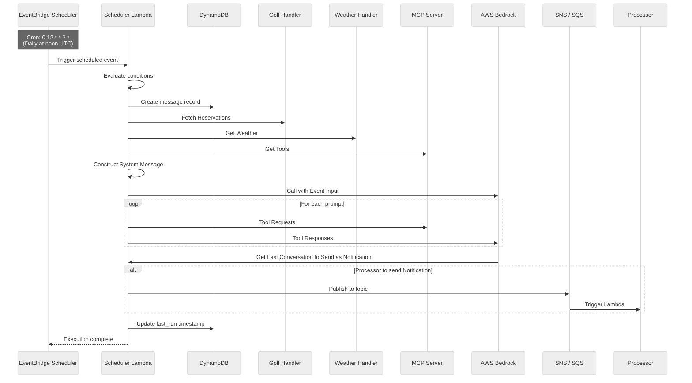

# Scheduled Event to Agent

---

## EventBridge Scheduler Workflow

Recurring schedule execution and message publishing.

```mermaid
---
config:
  look: handDrawn
  theme: neutral
---
sequenceDiagram
    participant EventBridge as EventBridge Scheduler
    participant Scheduler as Scheduler Lambda
    participant DDB as DynamoDB
    participant ghandler as Golf Handler
    participant whandler as Weather Handler 
    participant MCP as MCP Server
    participant LLM as AWS Bedrock
    participant SNS as SNS / SQS
    Note over EventBridge: Cron: 0 12 * * ? *<br/>(Daily at noon UTC)

    EventBridge->>Scheduler: Trigger scheduled event
    Scheduler->>Scheduler: Evaluate conditions
    Scheduler->>DDB: Create message record
    Scheduler->>ghandler: Fetch Reservations
    Scheduler->>whandler: Get Weather
    Scheduler->>MCP: Get Tools
    Scheduler->>Scheduler: Construct System Message  
    Scheduler->>LLM: Call with Event Input
    loop For each prompt
        Scheduler->>MCP: Tool Requests
        Scheduler->>LLM: Tool Responses 
    end
    LLM->>Scheduler: Get Last Conversation to Send as Notification
    alt Processor to send Notification
        Scheduler->>SNS: Publish to topic
        SNS->>Processor: Trigger Lambda
    end
    Scheduler->>DDB: Update last_run timestamp
    Scheduler-->>EventBridge: Execution complete
```

---