# Sequence Diagrams

This document contains Mermaid sequence diagrams that illustrate the key workflows and interactions in the rez_agent system.

## Table of Contents

- [Message Processing Flow](#message-processing-flow)
- [Web Action Execution](#web-action-execution)
- [Golf Tee Time Booking](#golf-tee-time-booking)
- [AI Agent Interaction (Legacy)](#ai-agent-interaction-legacy)
- [AI Agent with MCP Integration](#ai-agent-with-mcp-integration)
- [Schedule Creation](#schedule-creation)
- [EventBridge Scheduler Workflow](#eventbridge-scheduler-workflow)
- [Authentication Flow](#authentication-flow)
- [Error Handling and DLQ](#error-handling-and-dlq)

---

## Message Processing Flow

Basic message flow from API Gateway through to notification delivery.

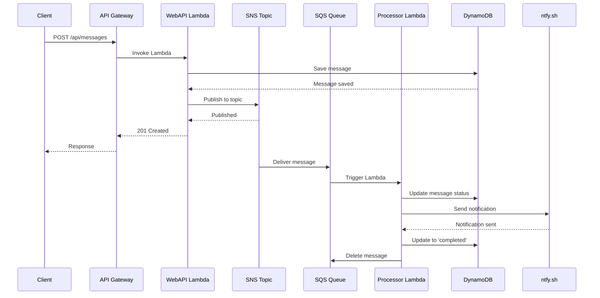

---

## Web Action Execution

Flow for executing web actions (weather, golf API calls).

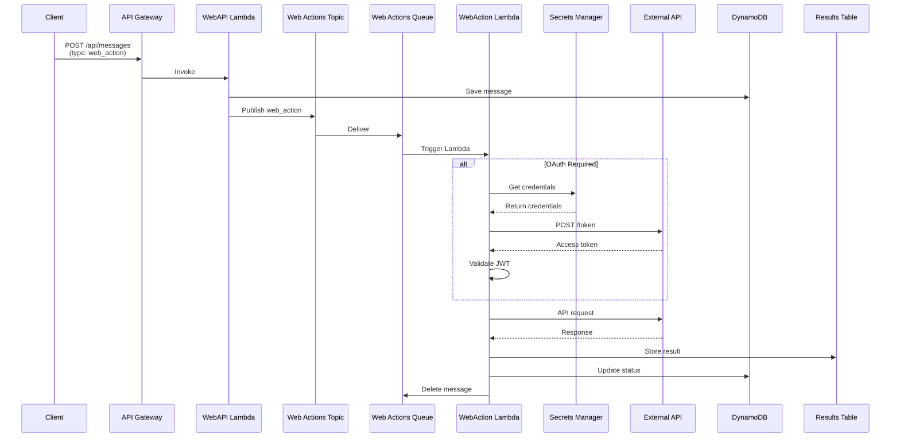

---

## Golf Tee Time Booking

Complete flow for searching and booking golf tee times.

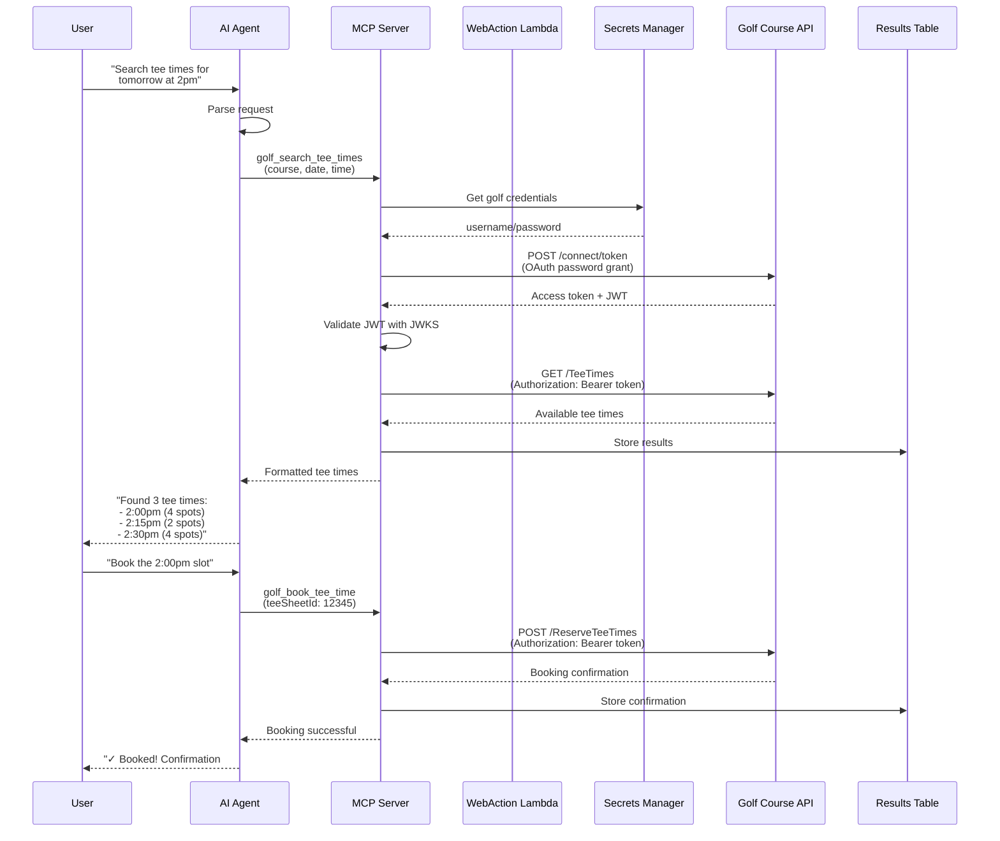

## AI Agent with MCP Integration

New flow using LangChain MCP Adapter (post-refactor).

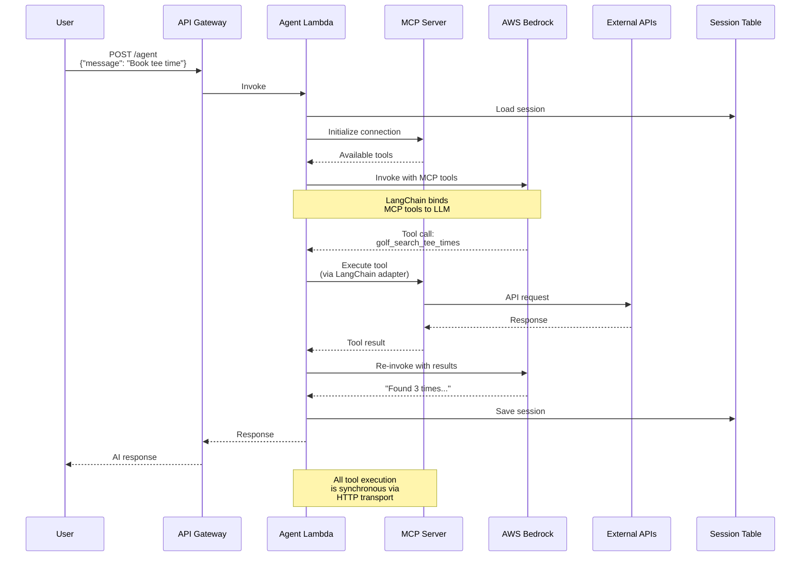

---

## Schedule Creation

Dynamic EventBridge schedule creation workflow.

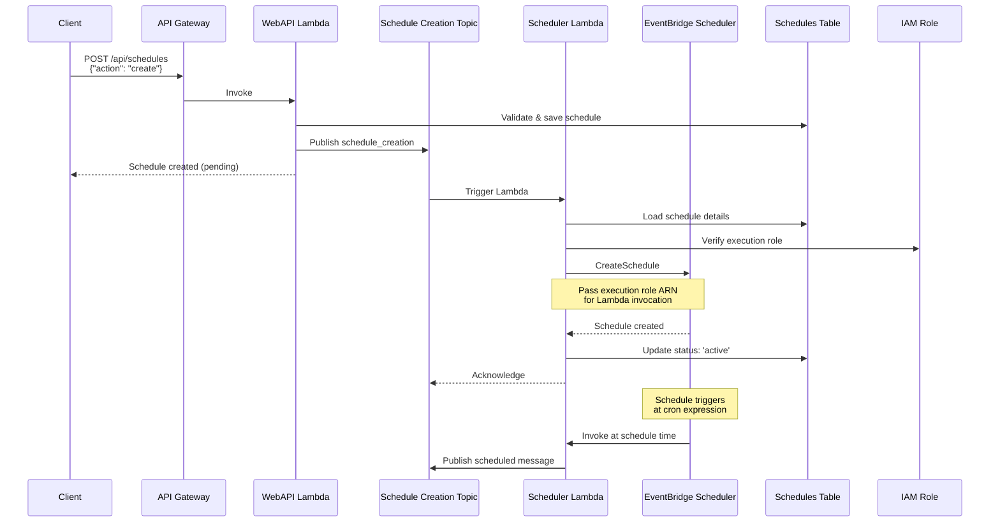

---

## EventBridge Scheduler Workflow

Recurring schedule execution and message publishing.

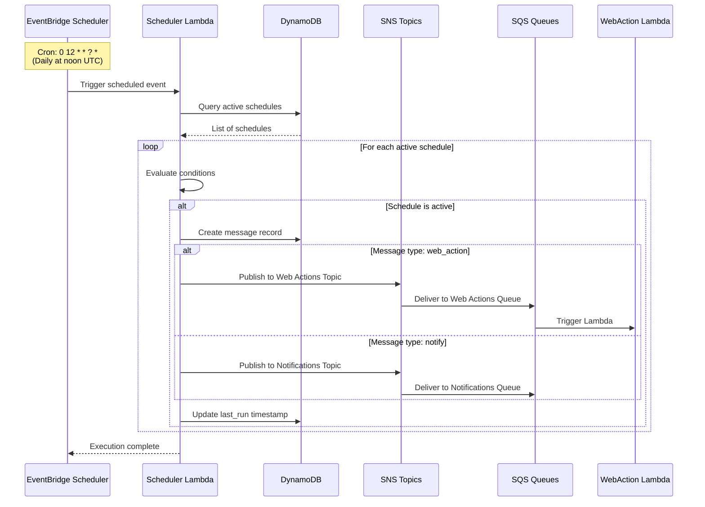

---

## Authentication Flow

OAuth 2.0 Password Grant with JWT validation.

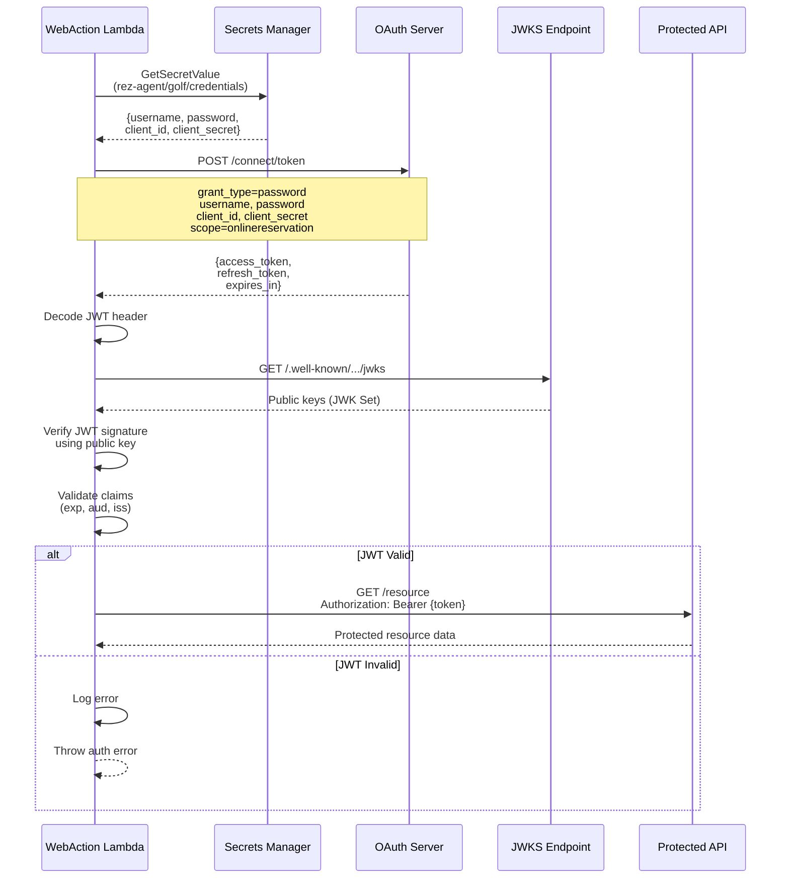

---

## Error Handling and DLQ

Dead letter queue processing and retry logic.

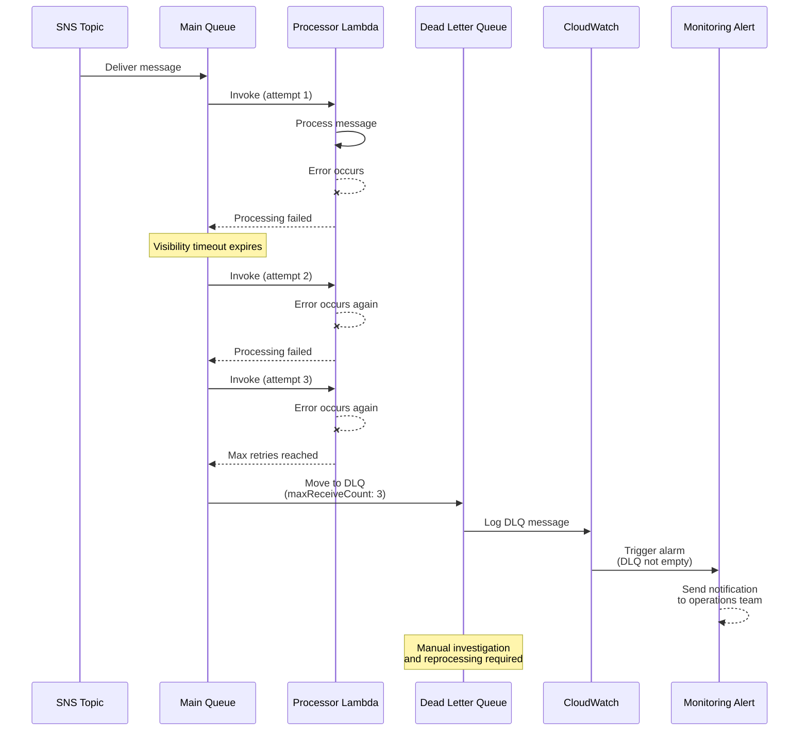

---

## MCP Server Tool Execution

Detailed MCP protocol interaction.

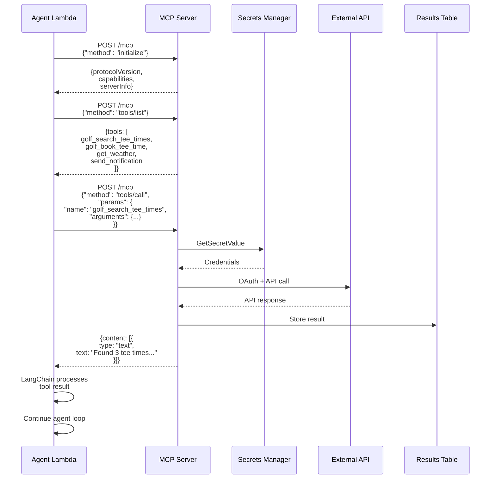

---

## API Gateway Request Flow

HTTP API routing to Lambda functions.

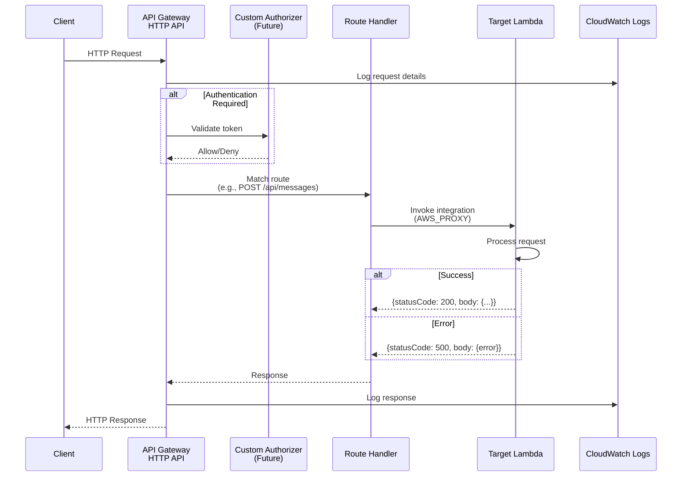

---

## Session Management

AI Agent session persistence and retrieval.

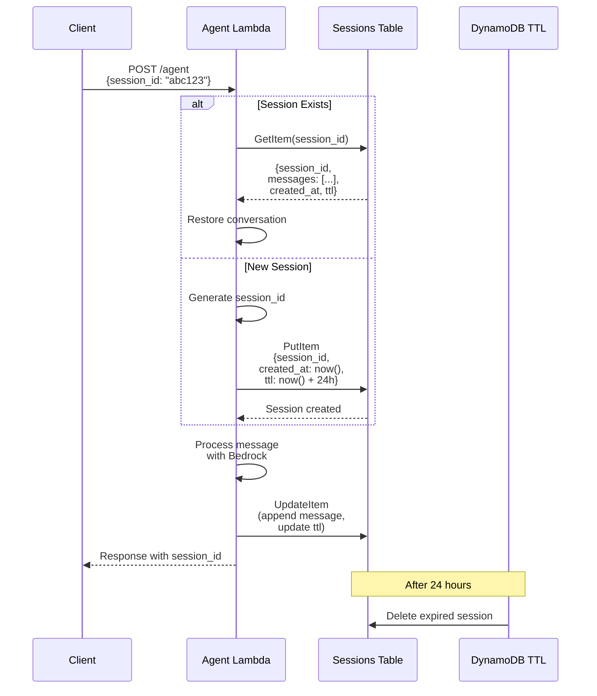

---

## Cost Tracking and Rate Limiting

Bedrock usage tracking and daily budget enforcement.

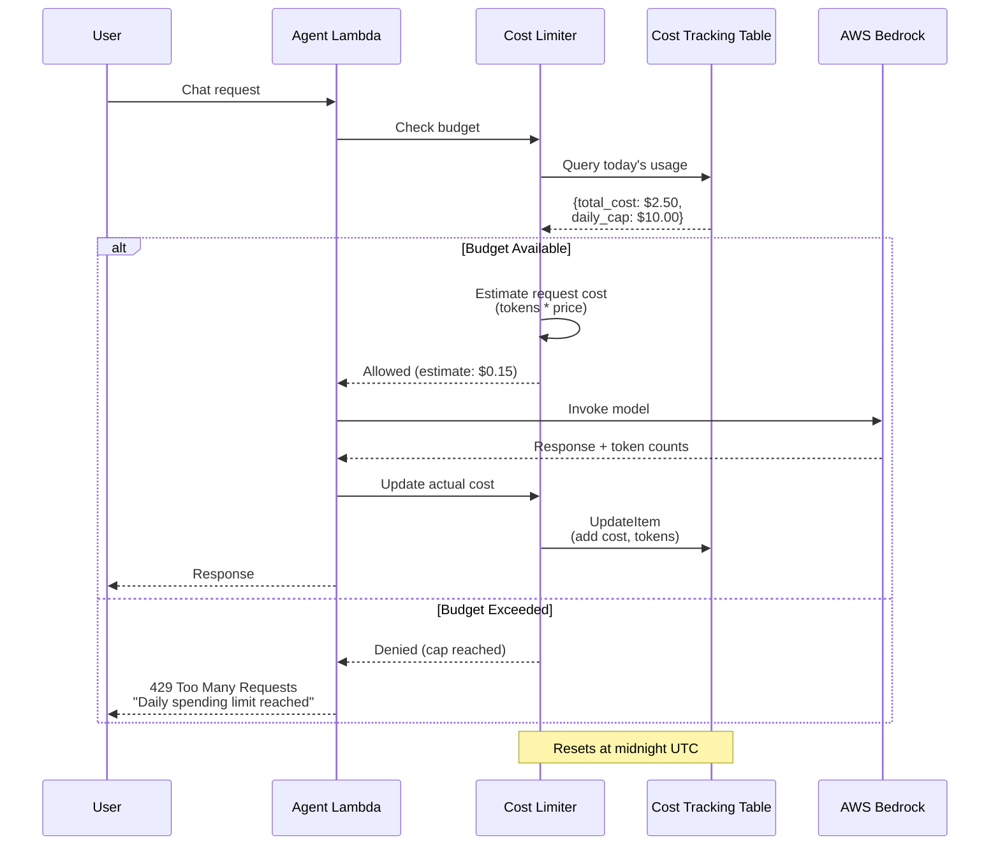

---

## Pulumi Deployment Flow

Infrastructure deployment and updates.

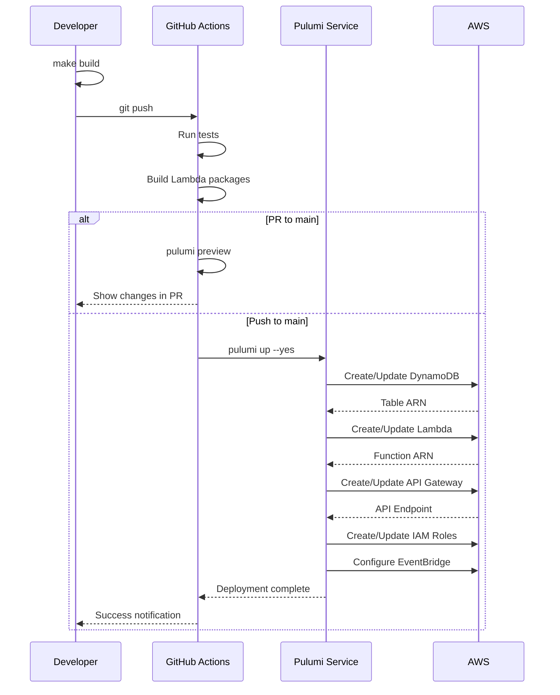

---

## Notes

### Diagram Conventions

- **Solid lines (→)**: Synchronous calls
- **Dashed lines (-->>)**: Return values/responses
- **Cross marks (--x)**: Failed operations
- **Notes**: Additional context or important information
- **Alt blocks**: Conditional logic paths
- **Loop blocks**: Repeated operations

### Viewing Diagrams

These diagrams use Mermaid syntax and can be viewed in:
- GitHub (native rendering)
- VS Code (with Mermaid extension)
- Documentation sites (MkDocs, Docusaurus, etc.)
- Mermaid Live Editor: https://mermaid.live/

### Related Documentation

- [Architecture Overview](architecture/README.md)
- [API Documentation](api/README.md)
- [Message Schemas](MESSAGE_SCHEMAS.md)
- [Deployment Guide](DEPLOYMENT_GUIDE.md)
