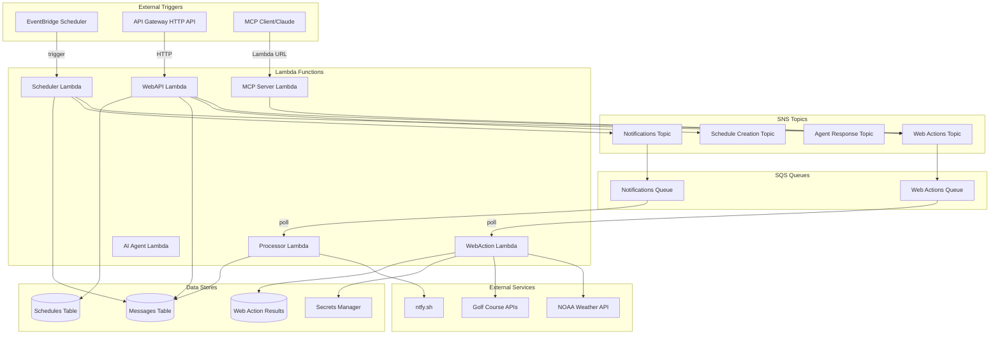

# Architecture Documentation

## Table of Contents

1. [System Overview](#system-overview)
2. [Architecture Patterns](#architecture-patterns)
3. [Component Diagram](#component-diagram)
4. [Data Flow](#data-flow)
5. [Lambda Functions](#lambda-functions)
6. [Messaging Architecture](#messaging-architecture)
7. [Data Storage](#data-storage)
8. [Security Architecture](#security-architecture)
9. [Scaling and Performance](#scaling-and-performance)

## System Overview

rez_agent is a serverless, event-driven automation platform built entirely on AWS managed services. The architecture follows microservices principles with decoupled components communicating asynchronously via SNS/SQS.

### Design Principles

- **Serverless-First**: No servers to manage, automatic scaling
- **Event-Driven**: Components react to events rather than polling
- **Loosely Coupled**: Components communicate via message queues
- **Single Responsibility**: Each Lambda function has one clear purpose
- **Fail-Safe**: Automatic retries, dead letter queues, error handling
- **Observable**: Structured logging, metrics, and optional X-Ray tracing

## Architecture Patterns

### 1. Pub/Sub Pattern (SNS/SQS)

```
┌──────────┐
│ Producer │
└─────┬────┘
      │ publish
      ▼
┌──────────────┐
│  SNS Topic   │
└──┬────────┬──┘
   │        │ subscribe
   ▼        ▼
┌─────┐  ┌─────┐
│ SQS │  │ SQS │
└──┬──┘  └──┬──┘
   │        │
   ▼        ▼
┌──────┐ ┌──────┐
│Lambda│ │Lambda│
└──────┘ └──────┘
```

**Benefits**:
- Decouples producers from consumers
- Enables fanout (one message to multiple consumers)
- Automatic retry with exponential backoff
- Dead letter queue for failed messages

### 2. Message Routing Pattern

```
┌────────────┐
│ Web API    │
└─────┬──────┘
      │
      ▼
┌─────────────────────┐
│ Topic Router        │
│ (based on msg type) │
└─┬─────┬──────┬──────┘
  │     │      │
  ▼     ▼      ▼
 SNS1  SNS2   SNS3
  │     │      │
  ▼     ▼      ▼
WebAct Agent  Sched
```

Messages are routed to different SNS topics based on `message_type`:
- `web_action` → Web Actions Topic
- `agent_response` → Agent Response Topic
- `schedule_creation` → Schedule Creation Topic
- `notify` → Notifications Topic

### 3. Repository Pattern

```go
// Repository interface
type MessageRepository interface {
    SaveMessage(ctx context.Context, message *Message) error
    GetMessage(ctx context.Context, id string) (*Message, error)
}

// DynamoDB implementation
type DynamoDBRepository struct {
    client *dynamodb.Client
    table  string
}
```

**Benefits**:
- Abstracts data access layer
- Enables testing with mock repositories
- Allows switching storage backends

### 4. Handler Registry Pattern

```go
// Handler interface
type WebActionHandler interface {
    GetActionType() WebActionType
    Execute(ctx context.Context, args map[string]interface{},
            payload *WebActionPayload) ([]string, error)
}

// Registry
type HandlerRegistry struct {
    handlers map[WebActionType]WebActionHandler
}
```

**Benefits**:
- Easy to add new action types
- Clean separation of concerns
- Testable in isolation

## Component Diagram



## Data Flow

### 1. Scheduled Task Flow

```
EventBridge Scheduler (cron trigger)
    ↓
Scheduler Lambda
    ↓
Create Message (DynamoDB)
    ↓
Publish to SNS Topic (based on task type)
    ↓
SQS Queue
    ↓
Processor/WebAction Lambda
    ↓
Execute Task
    ↓
Update Message Status (DynamoDB)
    ↓
Publish Notification
    ↓
ntfy.sh
```

### 2. Web Action Flow

```
API Gateway HTTP API
    ↓
WebAPI Lambda
    ↓
Validate Request
    ↓
Create Message (DynamoDB)
    ↓
Publish to Web Actions Topic (SNS)
    ↓
Web Actions Queue (SQS)
    ↓
WebAction Lambda (triggered by SQS)
    ↓
Get OAuth Token (Secrets Manager)
    ↓
Execute HTTP Request (external API)
    ↓
Save Result (DynamoDB)
    ↓
Publish Notification (SNS)
    ↓
ntfy.sh
```

### 3. AI Agent Flow (MCP)

```
Claude Desktop (via MCP Client)
    ↓
MCP Server Lambda (Lambda URL)
    ↓
Parse MCP Tool Request
    ↓
Create Message (DynamoDB)
    ↓
Publish to Web Actions Topic (SNS)
    ↓
Web Actions Queue (SQS)
    ↓
WebAction Lambda
    ↓
Execute Action (Golf/Weather API)
    ↓
Return Result to MCP Server
    ↓
MCP Server responds to Claude
```

### 4. Dynamic Schedule Creation Flow

```
API Gateway HTTP API
    ↓
WebAPI Lambda
    ↓
Validate Schedule Request
    ↓
Create Message (DynamoDB)
    ↓
Publish to Schedule Creation Topic (SNS)
    ↓
Scheduler Lambda (subscribed to topic)
    ↓
Create EventBridge Schedule
    ↓
Save Schedule Metadata (DynamoDB)
    ↓
Publish Confirmation (SNS)
```

## Lambda Functions

### Scheduler Lambda

**Purpose**: Process EventBridge schedule triggers and create tasks

**Triggers**: EventBridge Scheduler (cron expressions)

**Responsibilities**:
- Create scheduled messages
- Publish to appropriate SNS topics
- Handle schedule creation requests

**Key Code**: `cmd/scheduler/main.go`

### Processor Lambda

**Purpose**: Process notification messages and send to ntfy.sh

**Triggers**: SQS (Notifications Queue)

**Responsibilities**:
- Poll notification queue
- Send push notifications
- Update message status

**Key Code**: `cmd/processor/main.go`

### WebAction Lambda

**Purpose**: Execute HTTP REST API calls with OAuth authentication

**Triggers**: SQS (Web Actions Queue)

**Responsibilities**:
- OAuth 2.0 authentication
- JWT verification
- HTTP request execution
- Weather API integration
- Golf course API integration

**Key Code**: `cmd/webaction/main.go`

**Handlers**:
- `WeatherHandler`: NOAA Weather API
- `GolfHandler`: Golf course reservation APIs

### WebAPI Lambda

**Purpose**: HTTP API for message and schedule management

**Triggers**: API Gateway HTTP API

**Responsibilities**:
- Message creation
- Schedule creation
- Message routing to SNS topics

**Key Code**: `cmd/webapi/main.go`

**Endpoints**:
- `POST /api/messages`: Create message
- `POST /api/schedules`: Create/manage schedules

### AI Agent Lambda

**Purpose**: Anthropic Claude AI agent for intelligent automation

**Triggers**: Agent Response Topic (SNS)

**Responsibilities**:
- Process AI agent responses
- Natural language task understanding
- Intelligent decision making

**Key Code**: `cmd/agent/` (Python)

### MCP Server Lambda

**Purpose**: Model Context Protocol server for Claude integration

**Triggers**: Lambda Function URL (HTTP)

**Responsibilities**:
- MCP protocol implementation
- Tool execution (golf, weather, notifications)
- Request/response handling

**Key Code**: `cmd/mcp/main.go`

**Available Tools**:
- `golf_search_tee_times`
- `golf_book_tee_time`
- `golf_fetch_reservations`
- `get_weather_forecast`
- `send_notification`

## Messaging Architecture

### SNS Topics

```
┌───────────────────────────────────────┐
│         SNS Topic Hierarchy           │
├───────────────────────────────────────┤
│                                       │
│  Web Actions Topic                    │
│    ├─ Web Actions Queue (SQS)        │
│    └─ Subscriptions: WebAction Lambda│
│                                       │
│  Notifications Topic                  │
│    ├─ Notifications Queue (SQS)      │
│    └─ Subscriptions: Processor Lambda│
│                                       │
│  Agent Response Topic                 │
│    ├─ Agent Queue (SQS)              │
│    └─ Subscriptions: AI Agent Lambda │
│                                       │
│  Schedule Creation Topic              │
│    └─ Subscriptions: Scheduler Lambda│
│                                       │
└───────────────────────────────────────┘
```

### Message Format

All messages follow a standard schema:

```json
{
  "id": "msg_20240115120000_123456",
  "version": "1.0",
  "created_date": "2024-01-15T12:00:00Z",
  "created_by": "scheduler",
  "stage": "prod",
  "message_type": "web_action",
  "status": "created",
  "payload": {
    "version": "1.0",
    "action": "weather",
    "url": "https://api.weather.gov/..."
  },
  "arguments": {},
  "updated_date": "2024-01-15T12:00:00Z",
  "retry_count": 0
}
```

### SQS Configuration

- **Visibility Timeout**: 6 minutes (2x Lambda timeout)
- **Message Retention**: 4 days
- **Maximum Receives**: 3 attempts
- **Dead Letter Queue**: Yes, for failed messages
- **Batch Size**: 10 messages per Lambda invocation

## Data Storage

### DynamoDB Tables

#### Messages Table

**Table Name**: `rez-agent-messages-{stage}`

**Partition Key**: `id` (String)

**Attributes**:
- `id`: Message ID
- `version`: Schema version
- `created_date`: Timestamp
- `created_by`: Creator identifier
- `stage`: Environment
- `message_type`: Type of message
- `status`: Processing status
- `payload`: Message content
- `arguments`: Additional parameters
- `updated_date`: Last update timestamp
- `retry_count`: Number of retries

**TTL**: Not enabled (messages are kept indefinitely)

#### Schedules Table

**Table Name**: `rez-agent-schedules-{stage}`

**Partition Key**: `id` (String)

**Attributes**:
- `id`: Schedule ID
- `name`: Schedule name
- `schedule_arn`: EventBridge Schedule ARN
- `schedule_expression`: Cron/rate expression
- `timezone`: Schedule timezone
- `target_type`: Target Lambda function
- `message_type`: Type of message to create
- `payload`: Message payload template
- `created_date`: Creation timestamp
- `updated_date`: Last update timestamp
- `status`: Active/Inactive

#### Web Action Results Table

**Table Name**: `rez-agent-web-action-results-{stage}`

**Partition Key**: `id` (String)

**Attributes**:
- `id`: Result ID
- `message_id`: Parent message ID
- `action`: Action type
- `url`: Target URL
- `status`: Success/Failed
- `response_code`: HTTP status code
- `response_body`: Response (truncated to 50KB)
- `error_message`: Error details
- `execution_time_ms`: Duration in milliseconds
- `created_date`: Timestamp

**TTL**: 3 days (auto-deletion)

### Secrets Manager

**Secret Names**:
- `rez-agent/golf/credentials-{stage}`: Golf course OAuth credentials

**Secret Format**:
```json
{
  "username": "user@example.com",
  "password": "password123",
  "client_id": "optional-client-id"
}
```

## Security Architecture

### IAM Roles and Policies

Each Lambda function has its own execution role with least-privilege permissions:

```
┌────────────────────────────────────────┐
│ Scheduler Lambda Role                  │
├────────────────────────────────────────┤
│ - DynamoDB: PutItem (Messages)         │
│ - SNS: Publish (all topics)            │
│ - EventBridge: CreateSchedule          │
│ - CloudWatch: Logs                     │
└────────────────────────────────────────┘

┌────────────────────────────────────────┐
│ WebAction Lambda Role                  │
├────────────────────────────────────────┤
│ - DynamoDB: GetItem, PutItem, UpdateItem│
│ - SNS: Publish (Notifications)         │
│ - Secrets Manager: GetSecretValue      │
│ - SQS: ReceiveMessage, DeleteMessage   │
│ - CloudWatch: Logs                     │
└────────────────────────────────────────┘

┌────────────────────────────────────────┐
│ WebAPI Lambda Role                     │
├────────────────────────────────────────┤
│ - DynamoDB: PutItem, GetItem           │
│ - SNS: Publish (all topics)            │
│ - CloudWatch: Logs                     │
└────────────────────────────────────────┘
```

### Network Security

- **No VPC**: Lambda functions run in AWS-managed VPC
- **HTTPS Only**: All external API calls require HTTPS
- **SSRF Protection**: URL allowlist, hostname validation
- **Private IP Blocking**: Prevents access to internal resources

### Data Encryption

- **In Transit**: TLS 1.2+ for all communications
- **At Rest**:
  - DynamoDB: Encrypted with AWS managed keys
  - SNS/SQS: Encrypted with AWS managed keys
  - Secrets Manager: Encrypted with AWS managed keys

### Authentication Flow

```
┌─────────────┐
│ Web Action  │
│   Lambda    │
└──────┬──────┘
       │
       ▼
┌─────────────────┐
│ Secrets Manager │ Get credentials
│  (OAuth creds)  │
└──────┬──────────┘
       │
       ▼
┌─────────────────┐
│  OAuth Token    │ POST /token
│   Endpoint      │ (username/password grant)
└──────┬──────────┘
       │
       ▼
┌─────────────────┐
│  Access Token   │
│   + JWT Claims  │
└──────┬──────────┘
       │
       ▼
┌─────────────────┐
│  JWKS Endpoint  │ Fetch public keys
└──────┬──────────┘
       │
       ▼
┌─────────────────┐
│ Verify JWT      │ Signature + Claims
│  Signature      │
└──────┬──────────┘
       │
       ▼
┌─────────────────┐
│  Execute API    │ With Bearer token
│     Request     │
└─────────────────┘
```

## Scaling and Performance

### Auto-Scaling

All components auto-scale automatically:

- **Lambda**: Concurrent executions (default: 1000)
- **DynamoDB**: On-demand capacity mode
- **SNS/SQS**: Unlimited throughput

### Performance Characteristics

| Component | Typical Latency | Max Throughput |
|-----------|-----------------|----------------|
| API Gateway | < 50ms | 10,000 req/s |
| Lambda (cold start) | 1-3s | N/A |
| Lambda (warm) | 10-100ms | 1000 concurrent |
| DynamoDB | < 10ms | On-demand |
| SNS Publish | < 50ms | Unlimited |
| SQS Poll | < 1s | 3000 msg/s |

### Optimization Strategies

1. **Lambda Warming**: Keep functions warm via scheduled pings
2. **Connection Pooling**: Reuse HTTP clients across invocations
3. **Batch Processing**: Process SQS messages in batches of 10
4. **Caching**: Cache JWKS public keys for 1 hour
5. **Async Processing**: Use SNS/SQS for async operations

### Cost Optimization

- **Lambda**: 128MB-512MB memory (tuned per function)
- **DynamoDB**: On-demand capacity (pay-per-request)
- **Logs**: 7-day retention (configurable)
- **S3**: Lifecycle policies for deployment artifacts

### Monitoring and Alerting

**CloudWatch Metrics**:
- Lambda invocations, errors, duration
- SQS queue depth, age of oldest message
- DynamoDB read/write capacity

**CloudWatch Alarms**:
- Lambda error rate > 5%
- SQS queue depth > 100
- Lambda throttles > 10

**X-Ray Tracing** (optional):
- End-to-end request tracing
- Service map visualization
- Performance bottleneck identification

## Disaster Recovery

### Backup Strategy

- **DynamoDB**: Point-in-time recovery enabled
- **Code**: All code in Git, deployed via Pulumi
- **Infrastructure**: Defined as code, reproducible

### Recovery Procedures

1. **Lambda Failure**: Auto-retry via SQS, DLQ for manual inspection
2. **Database Corruption**: Restore from point-in-time backup
3. **Region Outage**: Deploy to alternate region (manual process)

### High Availability

- **Multi-AZ**: All AWS services are multi-AZ by default
- **Failover**: Automatic for managed services
- **RTO**: < 1 hour (manual redeployment to new region)
- **RPO**: < 5 minutes (DynamoDB PITR)
