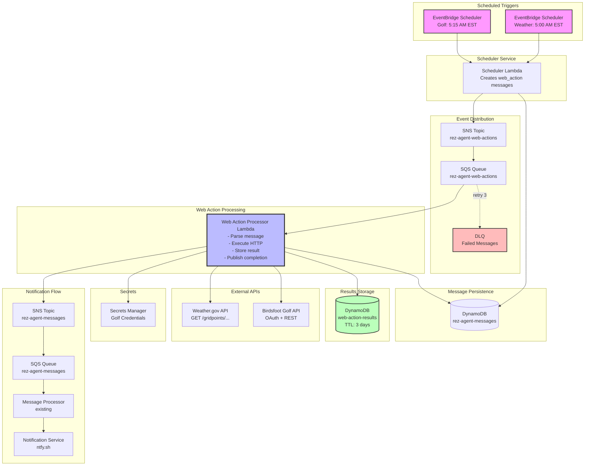
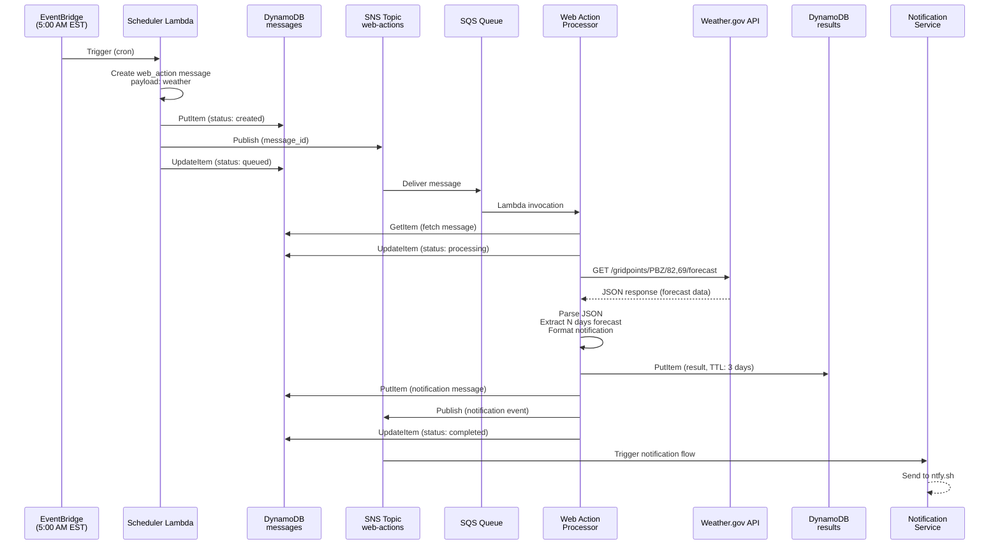
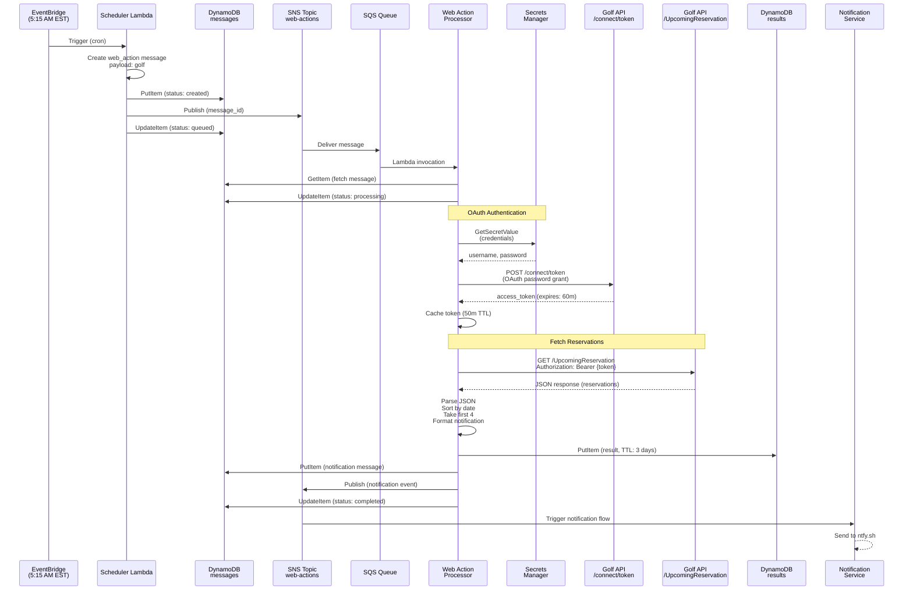
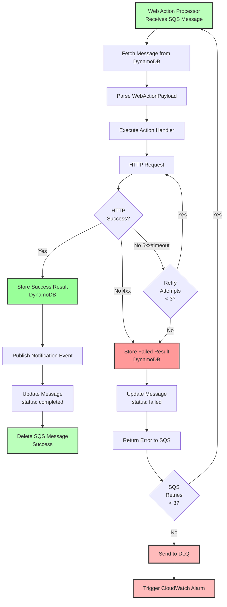
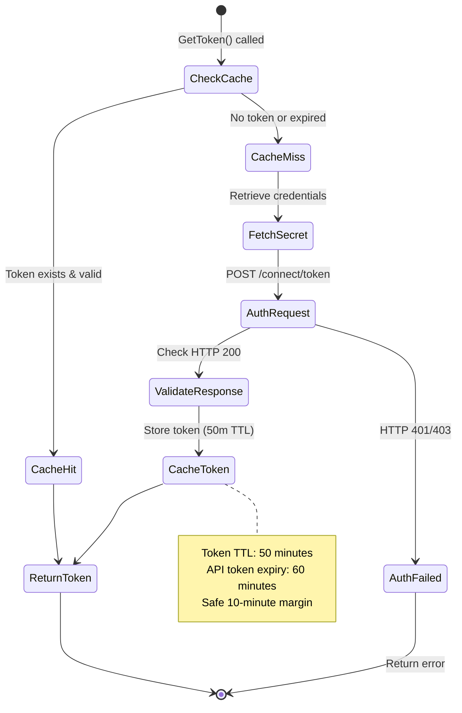
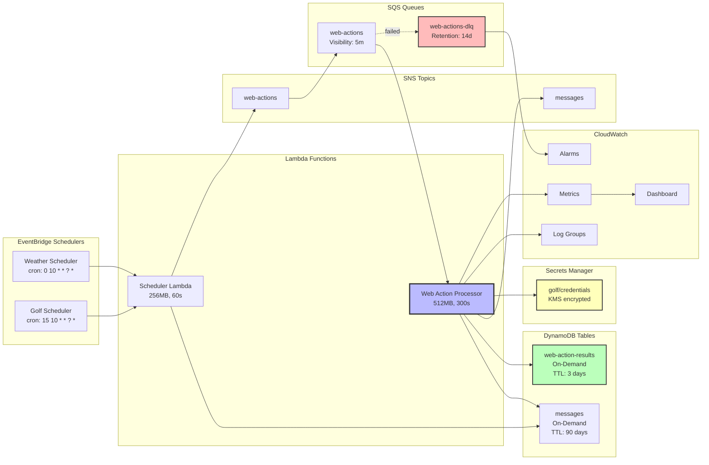
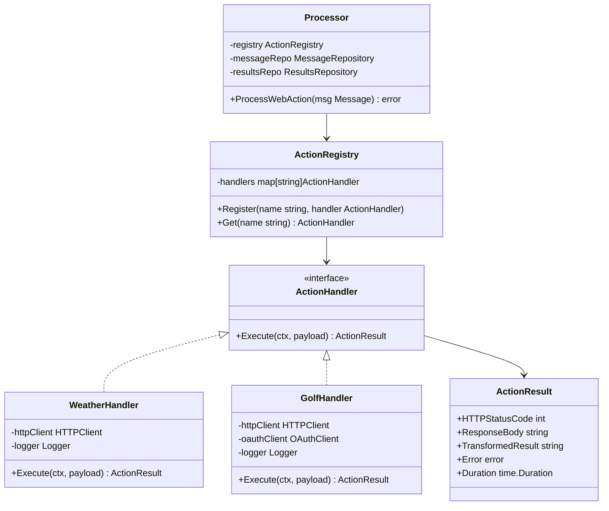
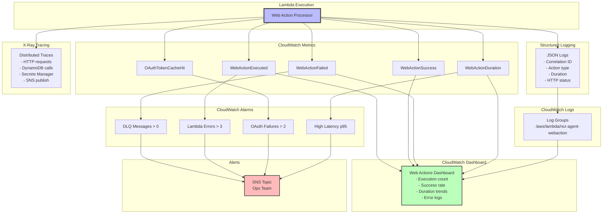
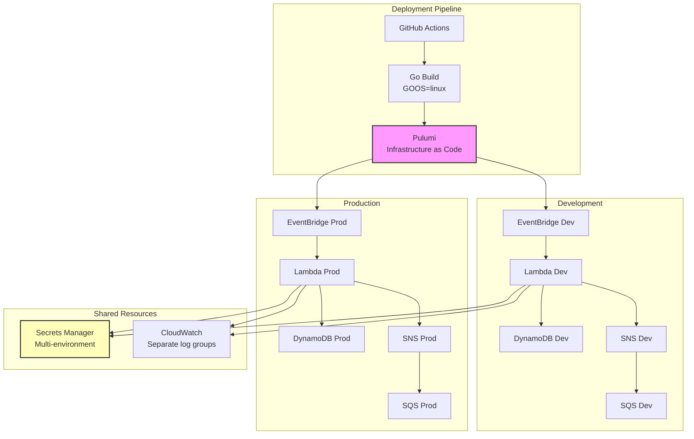

# Web Action Processor - Architecture Diagrams

This document contains visual architecture diagrams for the Web Action Processor feature.

---

## System Architecture Overview



---

## Weather Action Flow



---

## Golf Action Flow (with OAuth)



---

## Error Handling Flow



---

## Data Model Relationships

```mermaid
erDiagram
    MESSAGE ||--o{ WEB_ACTION_RESULT : creates
    MESSAGE {
        string id PK
        timestamp created_date SK
        string message_type
        string payload
        string status
        string stage
    }

    WEB_ACTION_RESULT {
        string action_id PK
        timestamp executed_at SK
        string message_id FK
        string action
        string url
        string status
        int http_status_code
        string response_body
        string transformed_result
        string error_message
        int ttl
        int duration_ms
        string stage
    }

    WEB_ACTION_PAYLOAD {
        string version
        string url
        string action
        json arguments
        json auth_config
    }

    AUTH_CONFIG {
        string type
        string secret_name
        string token_url
        string scope
        json headers
    }

    MESSAGE ||--|| WEB_ACTION_PAYLOAD : contains
    WEB_ACTION_PAYLOAD ||--o| AUTH_CONFIG : may_have
```

---

## OAuth Token Caching



---

## Infrastructure Components



---

## Action Handler Registry Pattern



---

## Observability Stack



---

## Deployment Architecture



---

These diagrams provide a comprehensive visual representation of the Web Action Processor architecture, covering:

1. **System Overview**: High-level component interaction
2. **Message Flows**: Weather and Golf action sequences
3. **Error Handling**: Retry logic and DLQ flow
4. **Data Models**: DynamoDB table relationships
5. **OAuth Caching**: Token lifecycle state machine
6. **Infrastructure**: AWS resource topology
7. **Action Registry**: Code architecture pattern
8. **Observability**: Logging, metrics, tracing, and alerting
9. **Deployment**: Multi-environment architecture

These diagrams can be rendered in any Markdown viewer that supports Mermaid (GitHub, VS Code, etc.).
